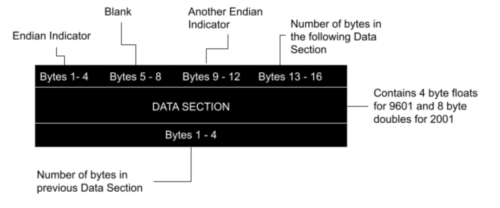
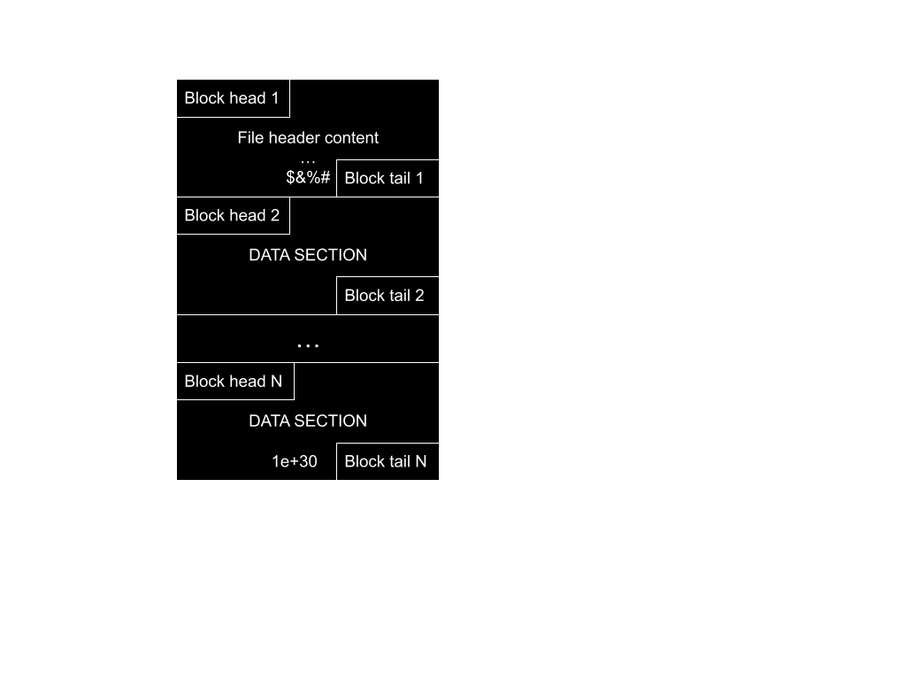

#hSpice Output Binaries and ASCII

## Introduction

This document describes the 9601 and 2001 binary formats for hSpice .ac*, .sw*, and .tr* output files. This is a companion document to the user manual for hspiceParser, a Python script that parses the 9601 and 2001 versions of the hSpice binary or ASCII output files. While there are other hSpice parsers (eg: [Matlab hSpice ToolBox](https://www.cppsim.com/download_hspice_tools.html)) and documents that describe the hSpice binary output (eg: [Gaw Data File Formats](https://www.rvq.fr/linux/gawfmt.php)), we wanted to make both another parser and another description of the hSpice 
binary output format. For more information on our reasoning for making this document, read this <link to other document>.


## General Overview

hSpice is a circuit simulator that produces an output file that contains voltage and current values produced by a circuit described by an input file.  The input file also describes the stimulus applied to the circuit.

hSpice input files can specify multiple simulations with slightly different circuits or stimuli to be specified in the same file, and each of the simulations produced in such a file is called a sweep. If an hSpice user decides to vary more than one parameter value they may use `.alter` statements, which result in additional output files being produced. One additional output file is produced for each `.alter` statement.

Setting the `.option post=1` hSpice directive in the input file causes hSpice to produce binary output files with records of the simulation. The output files can be produced in many formats, but we will constrain our discussion to the 9601 and 2001 formats here. To specify the file format, use `.option post_version=9601` or `.option post_version=2001`. hSpice can also produce ASCII output files using `.option post=2`.

## Binary Format

Both binary formats share the same overall structure: a header followed by a series of ordered information sets that we will call blocks. The header is a special type of block, so the structure of blocks will be discussed first.

Each block consists of a 16-byte block head, some number of data bytes, and a four-byte block tail. The first 12 bytes in the block head specify the Endianness of the following data, and the last 4 bytes in the block head represent an integer describing the number of bytes in the rest of the block. The remaining bytes in the block are called the data section, and it contains the data stored in the block from the hSpice simulation. Finally, the last 4 bytes in the block are the block tail, and they are an integer representation of how many bytes were in that block. The entire binary file is a sequence of these blocks, though not all blocks are the same size.

<sub>Figure 1, block structure<sub>

The bytes in the data section must be interpreted differently for different formats.  All the blocks after the header contain the signal data from the simulation. The different formats are a memory saving tool, so the values in the 9601 format are represented as 4 byte floats while the values in the 2001 format are represented by 8 byte doubles. A single sweep can and likely will span multiple blocks, so to determine the end of a sweep there will be a terminating value. For the 9601 format this value is 1.0000000150474662e+30, and for the 2001 format the value is 1e+30. This termination value is still present when there are no sweeps set.

The data section consists of numerical values stored as binary values that are either 4 or 8 bytes long. The values are not consecutive values of one signal, instead the values for each recorded signal are interleaved in a specific order. The order is specified by a string in the header block, which is described below. An example is  shown in Figure 2, where the first value represents variable 1, then the next value represents variable 2, and so on. After all the simulation variables have been exhausted the pattern repeats. This pattern continues until the end of the sweep or the end of the simulation. If multiple sweeps are recorded in the file, then an additional value is inserted at the start of each sweep to indicate the working value of the swept variable in the current sweep. The signals that result from the sweep are recorded after this first value, and they are recorded in the same interleaved pattern.

>Var 1 value, Var 2 value, Var 3 value, Var 4 value, Var 5 value, Var 1 value, Var 2 value, Var 3 value, Var 4 value, Var 5 value, Var 1 value...

<sub>Figure 2, interleaving pattern<sub>

The header block is the very first in the binary file, and while it contains a standard block head and block tail, it is unique because it contains UTF-8 plain text in the data section instead of binary data. The data section of the header block contains a 20 or 24 digit number, text describing the source file, copyright information, and the variable names for the signals recorded from the simulation.

The string in the header block data section consists of several parts. The first part of the header block string is a number that is 20 or 24 digits long (the length depends on if the format:  9601 produces a 20 digit number and 2001 produces a 24 digit number). The first four digits of this number denote the number of variables being monitored, the next 12 or 16 digits are not used by our parser, and the last 4 digits communicate the binary format (9601 or 2001). The 25th character in both 
formats is an asterisk. The next part of the header block is a series of human-readable strings: first, the name of the file that was simulated to generate the binary; second, information about the date and time of the simulation; and third, a copyright notice. The next part of the header is another number that represents the number of  sweeps that are in the file. Next will be a series of numbers that our parser does not use; there will be the same number of them as there are variables being tracked. Finally, the header ends with a list of variable/ parameter names followed by an end marker of “$&%#”. The end marker is followed by white space and the block tail: 4 bytes describing the header size in number of bytes as described above in the block description. There are no newline characters in the header block (or, for that matter, anywhere in the binary file).

```00050000000100009601    * exampleFile.sp                                                  06/08/2020      14:04:30 Copyright (c) 1986 - 2020 by Synopsys, Inc. All Rights Reserved.         10                                                                              1       1       1       1       8     TIME            v(0             v(vo            v(vs            i(vs            r1              $&%#   ```


<sub>Figure 3, overall binary file structure<sub>

***
## ASCII Format

Setting the `.option post=2` in an hSpice file being simulated will cause hSpice to produce an output file in ASCII format. The output files can be produced in multiple formats; here we will discuss the 9601 and 2001 formats. To specify the file format, use `.option post_version=9601` or `.option post_version=2001`. The ASCII format is similar to the binary format: it has a similar header section that is followed by interleaved signal data records in a body section.

The header section is identical to the header for the binary file described above, except that it does not have a block head or block tail, there is only ASCII text.

The body section consists of a series of simulated values. The values are ASCII representations of numbers in scientific notation (unless otherwise specified by the `.ingold` hSpice directive). The ASCII strings in the body section are different lengths for different formats. The values in the 9601 format are represented with a string of 11 characters in the form of 1.23456E±78. The values in the 2001 format are represented by a 13 character string in the form of 1.2345678E±90. There are no separators between the ASCII values.

The interleaving of the values stored in the ASCII format is the same as that of the binary format. Also like the binary format, sweeps start with a value of the swept variable.  Each sweep has a terminating value equal to 1E30, but the value of the terminator depends on the format. The terminator value in the 9601 format is 0.10000E+31 followed by a newline.  The terminator value in the 2001 format is 0.1000000E+31, also followed by a newline character. This termination value is still present when there are no sweeps.


<sub>Figure 4, overall ASCII file structure<sub>
