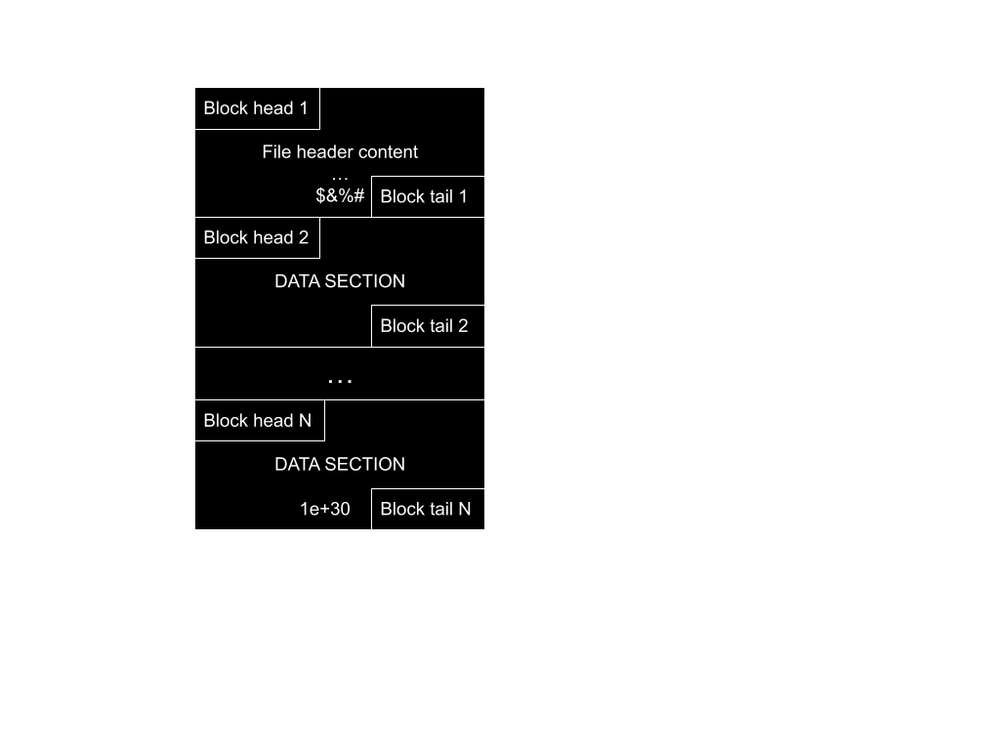
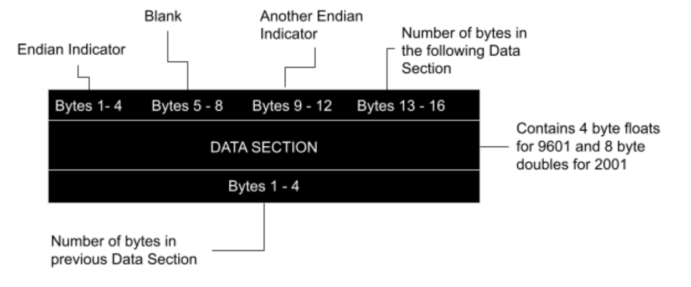

# hSpice Output Binaries and ASCII

## Introduction

This document describes the 9601 and 2001 binary formats for hSpice .ac*, .sw*, and .tr* output files. This is a companion document to the user manual for hspiceParser, a Python script that parses the 9601 and 2001 versions of the hSpice binary or ASCII output files. While there are other hSpice parsers (eg: [Matlab hSpice ToolBox](https://www.cppsim.com/download_hspice_tools.html)) and documents that describe the hSpice binary output (eg: [Gaw Data File Formats](https://www.rvq.fr/linux/gawfmt.php)), we wanted to make both another parser and another description of the hSpice
binary output format. For more information on our reasoning for making this document, read this <link to other document>.


## General Overview

hSpice is a circuit simulator that produces an output file that contains voltage and current values produced by a circuit described by an input file.  The input file also describes the stimulus applied to the circuit.

hSpice input files can specify multiple simulations with slightly different circuits or stimuli to be specified in the same file, and each of the simulations produced in such a file is called a sweep. If an hSpice user decides to vary more than one parameter value they may use `.alter` statements, which result in additional output files being produced. One additional output file is produced for each `.alter` statement.

Setting the `.option post=1` hSpice directive in the input file causes hSpice to produce binary output files with records of the simulation. The output files can be produced in many formats, but we will constrain our discussion to the 9601 and 2001 formats here. To specify the file format, use `.option post_version=9601` or `.option post_version=2001`. hSpice can also produce ASCII output files using `.option post=2`.

## Binary Format

Both binary formats share the same overall structure: they are built up from of ordered sets of bytes called blocks, and every file contains a header block followed by a series of data blocks. The header is a special type of block, so the structure of blocks in general is discussed first.  After that, we discuss data blocks and the file as a whole.



<sub>Figure 1. Overall binary file structure</sub>


## A Generic Block

Each block consists of three sections, a 16-byte block head, a data section that contains some number of data bytes, and a four-byte block tail. The first 12 bytes in the block head specify the Endianness of the following data, and the last 4 bytes in the block head are an integer describing the number of bytes in the data section. This is followed by the data section, which is the specified number of bytes long. Finally, the last 4 bytes in the block are the block tail, and they are an integer representation of how many bytes are in the preceding block. The entire binary file is a sequence of these blocks, though not all blocks are the same size.


<sub>Figure 2. Block structure</sub>


## The Header Block


The header block is the very first block in the binary file. While it contains a standard block head and block tail, it is unique because its data section contains UTF-8 plain text instead of binary data. The header encodes metadata about the simulation and the structure of the data that follows.

The header block data section is a single long string (no newlines in the actual file) composed of several fields in a fixed order:

- **Simulation variable and format descriptor**: A number, either 20 or 24 digits long (depending on format). This encodes:
	- The first 4 digits: number of variables being monitored (e.g., `0005` for 5 variables)
	- The next 12 or 16 digits: not used by the parser (reserved or unknown purpose)
	- The last 4 digits: the binary format (`9601` or `2001`)
- **Asterisk separator**: The 25th character is always an asterisk (`*`).
- **Input file name**: The name of the simulated file (e.g., `exampleFile.sp`)
- **Date, time, and copyright**: Human-readable fields with the date, time, and copyright notice.
- **Number of sweeps**: An integer indicating how many sweeps are in the file.
- **Unused numbers**: A series of numbers (one per variable) not used by the parser.
- **Variable/parameter names**: A list of variable or parameter names, each separated by whitespace.
  - The first name is always the sweep parameter (e.g., `gg` for `.dc gg 0 1 0.1`).
  - **Note:** If there are 2D sweeps (such as in `.dc` analysis with two sources being swept), the second parameter name shows up in the list as a variable name. For example, if doing `.dc` analysis with sweeping `gg` and `dd`, and monitoring `v(A)`, `v(B)`, and `v(C)`, the variable/parameter names would be: `gg v(A v(B v(C dd`.
- **End marker**: The string `$&%#` marks the end of the header content.
- **Whitespace and block tail**: The end marker is followed by whitespace and then the block tail (4 bytes, not part of the string, but part of the block structure).

**Example breakdown:**

```
00050000000100009601    * exampleFile.sp
06/08/2020      14:04:30 Copyright (c) 1986 - 2020 by Synopsys, Inc. All Rights Reserved.
10
1       1       1       1       8
TIME            v(0             v(vo            v(vs            i(vs            r1
$&%#
```

- `0005` — 5 variables
- `000000010000` — reserved/unused
- `9601` — format version
- `*` — separator
- `exampleFile.sp` — simulated file name
- `06/08/2020      14:04:30 ...` — date, time, copyright
- `10` — number of sweeps
- `1       1       1       1       8` — unused numbers (one per variable)
- `TIME ... r1` — variable/parameter names
- `$&%#` — end marker

**Note:** There are no newline characters in the actual header block; the above is formatted for readability. All fields are packed together as a single string.


## The Data Blocks


The data blocks follow the header block and contain the actual simulation results. Each data block has the same structure as described earlier (block head, data section, block tail), but the interpretation of the data section depends on the format:

- **9601 format:** Each value is a 4-byte (single-precision) float.
- **2001 format:** Each value is an 8-byte (double-precision) float.

**Key points about the data blocks:**

- The data section is a flat sequence of binary numbers representing the simulation results.
- The values are stored in an *interleaved* order: for each time step (or sweep point), the value for each variable is written in the order specified by the variable list in the header. For example, if the variables are `TIME`, `v(0)`, `v(vo)`, the data will be: `TIME_0, v(0)_0, v(vo)_0, TIME_1, v(0)_1, v(vo)_1, ...`.
- If there are multiple sweeps, each sweep's data is written in the same interleaved pattern. At the start of each sweep, an additional value is inserted to indicate the value of the swept parameter for that sweep.
- The end of a sweep is marked by a special *termination value*:
	- For 9601: `1.0000000150474662e+30`
	- For 2001: `1e+30`
	- This value is present even if there are no sweeps.
- A single sweep may span multiple data blocks. The blocks are simply concatenated; the logical data stream continues across block boundaries.

**Summary of the data block structure:**

- Data is stored as a sequence of binary values, interleaved by variable.
- Each sweep (if present) starts with the swept parameter value, followed by the interleaved data for all variables.
- The end of each sweep is marked by a termination value.
- The process repeats for all sweeps in the file.

**Example (for 3 variables, 2 time points, 1 sweep):**

```
TIME_0, v(0)_0, v(vo)_0, TIME_1, v(0)_1, v(vo)_1, TERMINATOR
```

**Example (for 2 sweeps, 2 variables, 2 time points):**

```
SWEEP1, VAR1_0, VAR2_0, VAR1_1, VAR2_1, TERMINATOR, SWEEP2, VAR1_0, VAR2_0, VAR1_1, VAR2_1, TERMINATOR
```

Refer to the header block for the exact order and names of the variables. The data blocks contain no additional metadata; all interpretation relies on the header.


```
00050000000100009601    * exampleFile.sp
06/08/2020      14:04:30 Copyright (c) 1986 - 2020 by Synopsys, Inc. All Rights Reserved.
10
1       1       1       1       8
TIME            v(0             v(vo            v(vs            i(vs            r1
$&%#
```


> TIME_value, v_0_value, v_vo_value, v_vs_value, i_vs_value, TIME_value, v_0_value, v_vo_value, v_vs_value, i_vs_value, TIME_value...


---

## ASCII Format


Setting the `.option post=2` in an hSpice file will cause hSpice to produce an output file in ASCII format. The ASCII output can be generated in both 9601 and 2001 formats, specified by `.option post_version=9601` or `.option post_version=2001`.

**Structure of the ASCII output file:**

- The file consists of two main sections: a header and a body.

### Header Section
- The header is similar to the binary format header, but is plain ASCII text (no block head or tail).
- It contains metadata such as the number of variables, file name, date/time, number of sweeps, and the list of variable/parameter names, ending with the `$&%#` marker.
- The header fields are separated by whitespace, and the order matches the binary format header.

### Body Section
- The body contains the simulation data as a sequence of ASCII-encoded numbers.
- Each value is written in scientific notation, with the format depending on the version:
	- **9601 format:** Each value is an 11-character string, e.g., `1.23456E+03`
	- **2001 format:** Each value is a 13-character string, e.g., `1.2345678E+03`
- There are **no separators** (such as spaces or commas) between values; values are packed together back-to-back.
- The order of values is *interleaved* by variable, just like in the binary format. For each time point (or sweep), the value for each variable is written in the order specified in the header.
- For multiple sweeps, each sweep's data is written in the same interleaved pattern, and each sweep starts with the value of the swept parameter.

### Sweep Termination
- The end of each sweep is marked by a special termination value:
	- **9601 format:** `0.10000E+31` (followed by a newline)
	- **2001 format:** `0.1000000E+31` (followed by a newline)
- This termination value is present even if there are no sweeps.

### Example (for 9601 format, 2 variables, 2 time points, 1 sweep):

```
1.00000E+00-2.00000E+00 1.10000E+00-2.20000E+00 0.10000E+31\n
```
Where each 11-character group is a value for a variable at a time point, and the last value is the sweep terminator.

### Notes
- The `.ingold` hSpice directive can change the number formatting.
- The exact order and names of variables are defined in the header.
- The ASCII format is easier to inspect manually, but is less compact than the binary format.


<sub>Figure 4. Overall ASCII file structure</sub>
